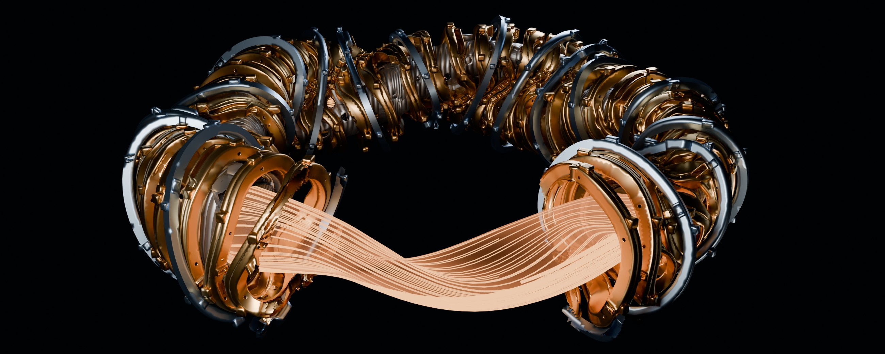
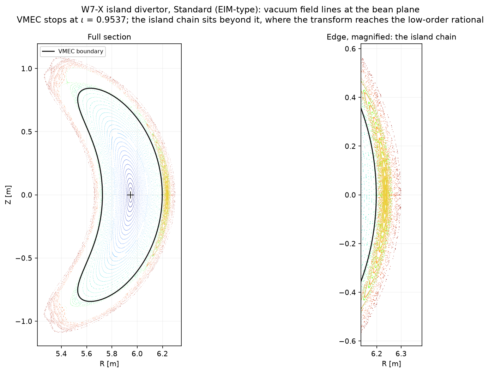
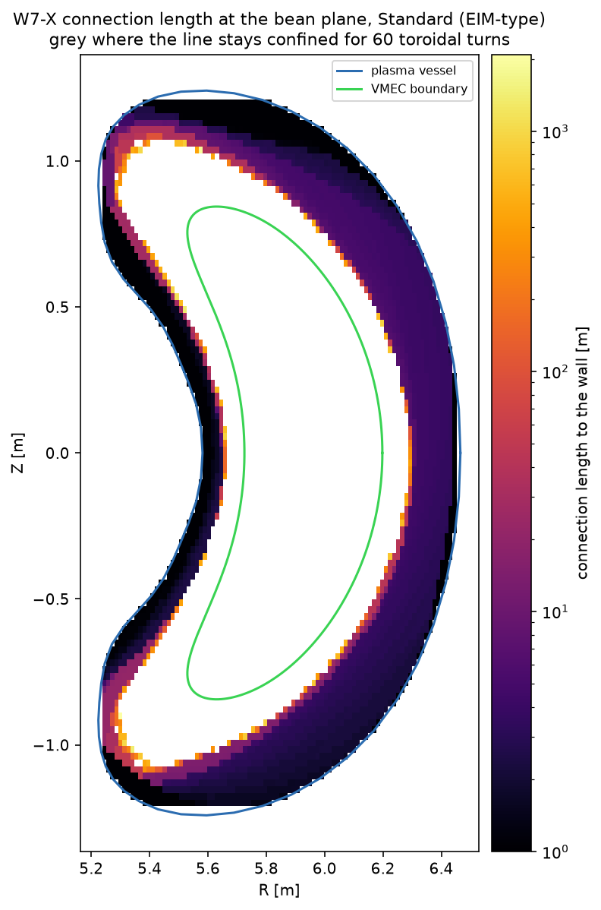
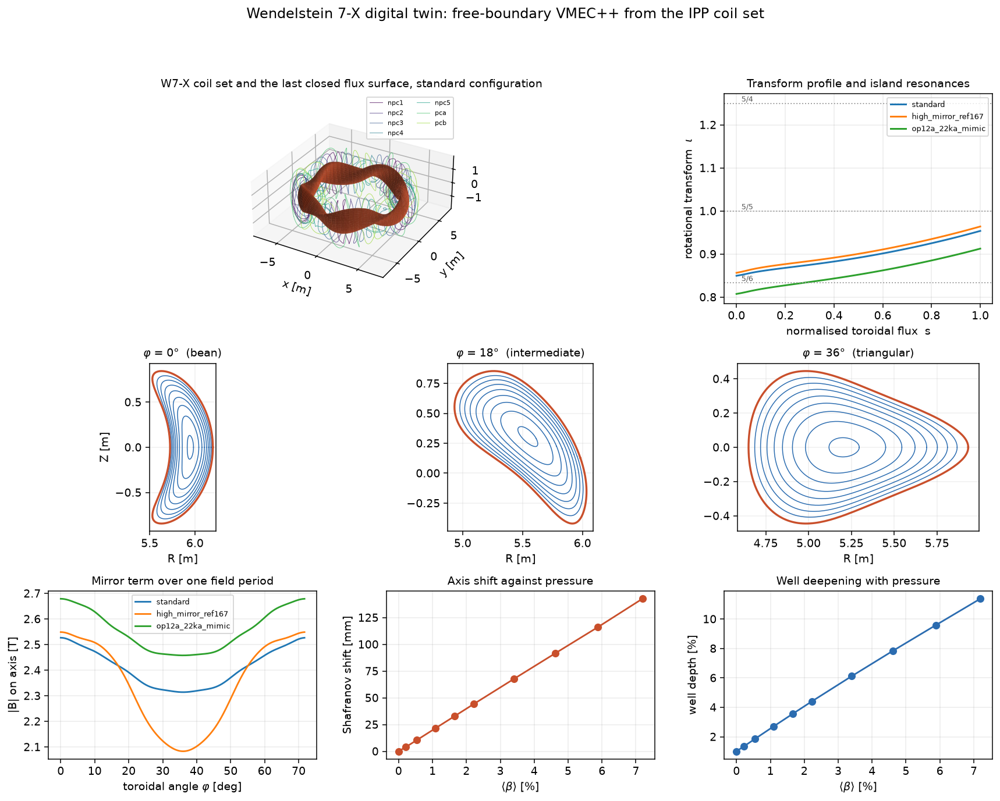

# w7x-twin

A free-boundary equilibrium and field-line model of the Wendelstein 7-X stellarator.
Coil currents and a plasma scenario are supplied; a converged three-dimensional ideal
MHD equilibrium and the derived machine quantities are returned, each carrying the
version of the geometry it was computed under and the published measurement it is
checked against.

Equilibria are computed with [VMEC++](https://github.com/proximafusion/vmecpp) in
free-boundary mode. The vacuum field is obtained by Biot-Savart integration over the
IPP filament model of the W7-X magnet system and held as a per-circuit response table,
so a change of coil current costs one weighted sum over circuits, with no mgrid file
regenerated. A converged equilibrium at scan resolution (`mpol` 7, `ntor` 6,
`ns` 25 → 51, `ftol` 10⁻¹¹) takes approximately 3 s on twelve cores.

[`docs/physics.md`](docs/physics.md) carries one topic account per subsystem; the
records under `results/` carry the current numbers.



*The seventy superconducting coils, cut open to show the traced magnetic field winding
through the plasma volume.*

## Magnet system

Twenty-two independently powered circuits.

| Circuits | Coils | Turns | Geometry |
|---|---|---|---|
| `npc1`–`npc5` | 50 non-planar modular, five types | 108 | IPP winding-pack filament model |
| `pca`, `pcb` | 20 planar, two types | 36 | IPP winding-pack filament model |
| `trim_a1`–`trim_a4` | 4 trim coils, type A, 3.5 × 3.3 m | 48 | reconstructed; mounting radius from CAD |
| `trim_b1` | 1 trim coil, type B, 2.8 × 2.2 m | 72 | reconstructed; mounting radius from CAD |
| `cc1u`–`cc5l` | 10 in-vessel control coils, one circuit each | 8 | reconstructed from published dimensions |

The control coils are one circuit each: the machine drives them as toroidal harmonics,
and an n = 2 pattern needs ten independent currents.

Plasma-facing components are carried alongside the vessel contour: the horizontal and
vertical divertor targets, the baffles and the scraper element, each as toroidal cuts of a
poloidal contour over part of a field period, completed by the five-fold rotation and the
stellarator symmetry that maps the upper units onto the lower ones.

The superconducting filaments are winding-pack centres, and `hardware/coils.py` expands
each into one filament per conductor turn. The non-planar pack is 108 turns as twelve
layers of nine: 155.6 mm across the turns at a 17.5 mm pitch, and 215.9 mm across the
layers, the distance between the engineering model's brick face planes, an 18.2 mm layer
pitch. The planar packs measure 105.0 mm across the turns and 108.9 mm across the layers,
and every pitch comes from that model.

Trim and control coil windings are reconstructions from published dimensions. The
mounting radius is 7.570 m, the outer vessel's outboard surface through the mounting
band, consistent with the 7.000 to 7.690 m the measured 1/1 correction pins; a Sobol
scan puts nearly the whole error-field bound on this one parameter at a correlation of
−0.96. `hardware/coils.py` also reads the measured filaments from IPP's coil database
where that service resolves, which is inside the institute.

Two single-filament sets of the superconducting coils are in circulation, `coils.w7x` and
`coils.w7x_v001`. They carry the same non-planar coils and differ in the planar ones; the
second is the CAD set, published by simsopt's configuration zoo as an order-48 Fourier fit.
The provenance record compares the file this package runs on against that fit and finds
the same filaments on all seven coils, so this is the CAD set.

### CAD checks

`python -m w7x_twin cad` writes `results/hardware/cad_geometry.json` from the IPP CAD
models [15]: the pack sections above, the mounting radius, the filaments 9.6 mm median
from the coil solids' mid-surfaces, `vessel.part` 13.3 mm median from the vessel model,
the divertor target contours on the released surfaces to 0.0 mm median and the baffles
to 1.3 mm with the scraper element absent from the release, and the plasma model
20.4 mm median and 62.1 mm at the 95th percentile from the twin's boundary, the tail at
the high-curvature tips near the triangular plane.

### Geometry version

`hardware/machine.py` hashes the coil set, the field grid, the boundary template, the
vessel contour and the plasma-facing components, and reports one version over them:

```
geometry e0624a09d0db [epoch=hhf coils=a1810c5f12e7 grid=dbbc11b5c45b
                       template=38dd0e23ff00 vessel=864272f7575e components=e234e9cda35f]
```

W7-X has run three in-vessel configurations, and to a model that traces field lines onto
plasma-facing components they are different machines: an inertially cooled limiter through
OP1.1, an inertially cooled test divertor unit through OP1.2, and the actively cooled
divertor from OP2. `machine.EPOCHS` maps campaigns onto them, so a campaign identifier
resolves an epoch and a result names the machine it belongs to:

```
limiter  fcedfcd70031    0 components   OP1.1
tdu      6aa3a39be777    9 components   OP1.2a, OP1.2b
hhf      e0624a09d0db   10 components   OP2.1 through OP2.5
```

Each consumer keys on the parts it reads. An equilibrium depends on the coil set and the
field grid, so its cache keys on that subset and is the same in all three epochs.

### Sources

| What | Where |
|---|---|
| `coils.w7x`, `axis_coefficients_w7x.csv` | [`proximafusion/vmecpp_large_cpp_tests`](https://github.com/proximafusion/vmecpp_large_cpp_tests) |
| Field grid, R ∈ [4.3, 6.7] m, Z ∈ [−1.2, 1.2] m, 121 × 121 × 36 per period | the coils file's own `&MGRID_NLI` namelist |
| Vessel contour, 41 toroidal cuts of 73 points per period | [`ORNL-Fusion/util-library`](https://github.com/ORNL-Fusion/util-library) |
| Divertor and baffle contours | cut from the released solids [15] by the `cut-contours` command; the scraper element, absent from the release, from `ORNL-Fusion/util-library` |
| CAD models and winding-pack model | Max-Planck-Institut für Plasmaphysik [15] |
| Thomson and charge-exchange profiles | digitised from the vector paths of the published figures, `records/thomson_profiles.json` |
| `high_mirror_ref167` | IPP reference run `input.w7x_ref_167_12_12` |
| `op12a_*_mimic`, `op2_22ka`, `narrow_mirror` | OP1.2a and OP2 modelling tapers, `ORNL-Fusion/util-library` |
| `standard` | equal current in all five modular coil types, planar coils unpowered |

`low_iota`, `standard_iota` and `high_iota` are derived: the planar coil current placing the
edge transform on the 5/6, 5/5 and 5/4 chain is solved by bracketed secant iteration, each
step a converged free-boundary equilibrium. They sit in a separate registry from the sourced
currents. Every configuration carries its source in `src/w7x_twin/hardware/machine.py`.

## Capabilities

Equilibrium and its derived quantities: rotational transform profile with the low-order
rationals it crosses, mirror term, magnetic well, plasma volume, aspect ratio, β, stored
energy, Shafranov shift, Mercier criterion with ballooning and tearing beside it, global
interchange modes, and flux-surface cross sections at any toroidal angle. Inverse solves
on the actuator space give the coil current for a specified field on axis and the planar
current for a specified edge transform.

Vacuum field-line tracing by fourth-order Runge-Kutta in either toroidal sense, with the
magnetic axis located as the fixed point of the return map, the transform measured from
the winding angle about the co-traced axis, Poincaré sections, and termination on the
vessel and components. A connection length is the two senses summed, the distance between
the surfaces a line ends on. Island chains and the stochastic edge are resolved here,
outside the nested-surface equilibrium model; the plasma's own contribution to that field
comes from volume Biot-Savart integration with its refinement extrapolated on the axis,
and from the virtual-casing boundary sheet outside the plasma, where the volume integrand
is singular.

Transport: a steady-state power balance anchored to the ISS04 scaling, a split holding the
drift-kinetic diffusivity at its computed value, a balance with both channels computed,
the turbulent one from a linear growth-rate grid over surfaces and both gradients closed
by the nonlinearly measured saturation response, and a discharge marched as one transient
solution with the scrape-off layer closing the edge at every step. Neoclassical
coefficients are solved with MONKES on twelve surfaces over collisionality and radial
electric field; the bootstrap current comes from the Redl formula and from the D₃₁
coefficient, iterated to self-consistency with the equilibrium, and diffused resistively
against the one measured toroidal current. The scrape-off layer samples the strike band
at five launch planes across a field period, reads the camera quantities in the band's
own frame, closes width against target temperature, radiates by the Lengyel integral
with each flux tube at its own layer density, and attributes strikes to the ten divertor
units. The ensemble carries the sampled input tolerances through the pipeline, so the
equilibrium quantities, the power balance, the bootstrap current and the exhaust chain
come back as intervals.

The machine's own imperfections: the measured 1/1 and 2/2 corrections driven on the trim
and control circuits over a whole-torus response table, the intrinsic error field as coil
deviations discriminated by the second harmonic they predict, and identified discharges
compared check by check against what their publications state in numbers.







## Installation

```bash
python -m venv venv
venv/bin/pip install -e .
python -m w7x_twin fetch data
```

VMEC++ links MKL for LAPACK. `run.sh` preloads the dispatch libraries, which some MKL
packagings do not resolve, and sets `OMP_NUM_THREADS` and the package path.

The twin reaches the solver through `vmecpp.run`, and a build with `-DVMECPP_USE_CUDA=ON`
executes the same call device-resident: every equilibrium of the beta scans, the
self-consistent bootstrap and coupled iterations and the ensemble draws then solves on the
GPU. `run_batch` solves sets of equilibria in one CUDA context; a discharge reproduced
from its waveform and a twin running in real time solve such sets.

## Use

```bash
./run.sh -m w7x_twin validate             # verification record, non-zero if anything disagrees
```

Equilibrium and field:

```bash
./run.sh -m w7x_twin equilibrium          # every configuration in the library
./run.sh -m w7x_twin beta standard        # pressure ramp with hot restart
./run.sh -m w7x_twin islands standard     # island divertor
./run.sh -m w7x_twin response             # the plasma field converged, and the island it leaves
./run.sh -m w7x_twin winding              # edge transform over every admissible winding-pack layout
./run.sh -m w7x_twin stability            # Mercier, ballooning, tearing and global modes
./run.sh -m w7x_twin ensemble             # machine quantities as intervals
```

Transport and current:

```bash
./run.sh -m w7x_twin transport            # neoclassical against anomalous
./run.sh -m w7x_twin efield               # the ambipolar radial electric field
./run.sh -m w7x_twin bootstrap            # both routes, attributed, diffused against the measured current
./run.sh -m w7x_twin coupled 2 5 10       # transport, bootstrap and equilibrium together
./run.sh -m w7x_twin computed             # the power balance on computed inputs
./run.sh -m w7x_twin density              # density from a particle balance
./run.sh -m w7x_twin deposition           # resonance and beam-path absorption
./run.sh -m w7x_twin history              # a discharge through its heating waveform
./run.sh -m w7x_twin transient            # one transient solution, the layer closing the edge
```

Turbulence, which needs stella:

```bash
./run.sh -m w7x_twin gyrokinetic          # linear growth rates
./run.sh -m w7x_twin growth-rate-grid     # the grid over surfaces and both gradients
./run.sh -m w7x_twin saturation           # the saturation response from nonlinear runs
./run.sh -m w7x_twin turbulence           # the power balance with both channels computed
```

Exhaust:

```bash
./run.sh -m w7x_twin exhaust 5 0.02       # heat load on the targets, and detachment
./run.sh -m w7x_twin incidence 5          # incidence within and between target elements
./run.sh -m w7x_twin recycling            # neutral pressure and the losses it drives
./run.sh -m w7x_twin strikes              # strikes resolved to the ten divertor units
./run.sh -m w7x_twin migration            # bootstrap current to strike-line position
```

The machine's own field errors and its discharges:

```bash
./run.sh -m w7x_twin errorfield           # the measured n = 1 error and its load imbalance
./run.sh -m w7x_twin symmetrise           # the 1/1 and 2/2 corrections and the load they leave
./run.sh -m w7x_twin trim-radius          # the mounting radius pinned against the measured correction
./run.sh -m w7x_twin intrinsic            # the intrinsic field as a coil deviation
./run.sh -m w7x_twin discharge            # against identified W7-X programmes
./run.sh -m w7x_twin profiles             # solved profiles against the digitised measured ones
```

Stepped-pressure equilibria, which need SPEC:

```bash
./run.sh -m w7x_twin spec                 # residual and island under both interface placements
./run.sh -m w7x_twin stepped              # the solve and the island it carries
```

Geometry and the rendered page:

```bash
./run.sh -m w7x_twin cad                  # CAD geometry against the package's
./run.sh -m w7x_twin cut-contours         # recut the component contours onto the released CAD
./run.sh -m w7x_twin export-geometry      # geometry bundle for the rendered twin
./run.sh -m w7x_twin export-field         # per-circuit field response, coarsened to what it must resolve
./run.sh -m w7x_twin page-error           # the page's grid and tracer against the model
python tools/tessellate_cad.py            # CAD solids as mesh buffers
python artifact/build_twin3d.py           # assemble the 3D page
```

```python
from w7x_twin.mhd.equilibrium import Twin, Scenario, SCAN
from w7x_twin.mhd import diagnostics

twin = Twin()
state = twin.state("standard", scenario=Scenario(peak_pressure_pa=5e4))
output = twin.solve(state, SCAN)
print(diagnostics.analyse(output))
```

Bootstrap current, driven by the kinetic profiles:

```python
from w7x_twin.mhd.equilibrium import Twin
from w7x_twin.plasma import current, kinetics

twin = Twin()
solution = current.solve_self_consistent(twin, "standard", kinetics.HIGH_PERFORMANCE)
print(solution.output.wout.ctor, "A")
```

## Module layout

```
src/w7x_twin/hardware/      machine.py circuits, coils files, configurations, epochs, the
                            geometry version and deposited energy; coils.py auxiliary sets
                            and finite build; walls.py vessel and components; cad.py CAD
                            readers
src/w7x_twin/magnetics/     field.py response tables, interpolation and harmonic conventions;
                            fieldlines.py tracing and connection lengths; plasma_response.py
                            the plasma's own field
src/w7x_twin/mhd/           equilibrium.py the forward model; diagnostics.py derived quantities
                            and stability; stepped_pressure.py the SPEC interface
src/w7x_twin/plasma/        kinetics.py profiles and the carbon they carry; transport.py power
                            and particle balance, deposition and the mixing-length channel;
                            neoclassical.py ripple and drift-kinetic coefficients; current.py
                            bootstrap, its diffusion, the coupled solve and waveforms
src/w7x_twin/plasma/edge.py the scrape-off layer: two-point closure, Lengyel radiation,
                            incidence, wetted area, recycling
src/w7x_twin/records/       programmes.py identified discharges, published quantities and the
                            digitised profiles; ensemble.py machine quantities as intervals
src/w7x_twin/analyses/      one module per subsystem, one entry point per command in the
                            table above; _common.py session-cached inputs, arguments,
                            tables and record writing; cli.py dispatches
tools/                      one-shot preparation: tessellate_cad.py meshes the CAD release,
                            digitise_profiles.py reads the paper under PyMuPDF, render_hero.py
                            renders under Blender
```

Two modules run in another interpreter and are driven through files, so that neither
DESC nor a CUDA-capable torch becomes a dependency of this package:
`plasma/_effective_ripple_desc.py` and `magnetics/_biot_savart_gpu.py`.

## Verification

`python -m w7x_twin validate` checks the machine-readable entries against published
values and exits non-zero on any disagreement outside its stated band. The discharge
comparison places 13 of 22 checks inside the accuracy their sources support;
`results/discharges/reproduce_discharge.json` carries every check and residual, and the
topic accounts in [`docs/physics.md`](docs/physics.md) carry the tables.

## Limitations

The default power balance is anchored to the ISS04 confinement scaling times a measured
per-discharge enhancement, and every quantity it returns is proportional to that number;
where a discharge publishes none, the model runs at 1.4. The balance with both channels
computed removes the anchor and returns 0.84 to 1.01 times ISS04 across 2 to 10 MW.

The equilibrium carries no island; the traced field does. An interface on the resonance
closes its island by construction, so the stepped-pressure scan runs both placements.

Nothing here is bound to a logged discharge: the programmes compared against are
identified by number, and their inputs are the published heating power, configuration and
the densities their sources state. The coils are the as-designed set; the CAD models fix
envelopes and mounting surfaces, not as-built filaments.

What stands open is [`todo.md`](todo.md).

## References

1. J. Schilling, E. Guiraud, V. Siska, *VMEC++*, Proxima Fusion GmbH (2025),
   doi:10.5281/zenodo.14800158.
2. J. Geiger, C. D. Beidler, Y. Feng, H. Maaßberg, N. B. Marushchenko, Y. Turkin,
   *Physics in the magnetic configuration space of W7-X*, Plasma Phys. Control.
   Fusion **57**, 014004 (2015).
3. T. Rummel, K. Riße, J. Kißlinger, M. Köppen, F. Füllenbach, H. Neilson, T. Brown,
   S. Ramakrishnan, *The trim coils for the Wendelstein 7-X magnet system*, IEEE
   Trans. Appl. Supercond. (2012).
4. A. Redl, C. Angioni, E. Belli, O. Sauter, Phys. Plasmas **28**, 022502 (2021).
   The stellarator generalisation used here, parametrised by the symmetry helicity, is
   the implementation in simsopt.
5. M. Landreman et al., *SIMSOPT: A flexible framework for stellarator optimization*,
   J. Open Source Softw. **6**, 3525 (2021).
6. J. L. Velasco, I. Calvo, F. I. Parra, J. M. García-Regaña, *MONKES: a fast neoclassical
   code for the evaluation of neoclassical transport coefficients in stellarators*, Nucl.
   Fusion **64**, 076030 (2024).
7. S. R. Hudson et al., *Computation of multi-region relaxed magnetohydrodynamic
   equilibria*, Phys. Plasmas **19**, 112502 (2012). The stepped-pressure solve uses the
   SPEC implementation.
8. M. Barnes, F. I. Parra, M. Landreman, *stella: An operator-split, implicit-explicit
   delta-f gyrokinetic code for general magnetic field configurations*, J. Comput. Phys.
   **391**, 365 (2019).
9. A. A. Mavrin, *Radiative cooling rates for low-Z impurities*, Plasma Phys. Rep. **43**,
   1023 (2017). The carbon coefficients are taken from the `radas` distribution
   (Commonwealth Fusion Systems, MIT licence) rather than refitted.
10. T. Klinger et al., *Overview of first Wendelstein 7-X high-performance operation*,
    Nucl. Fusion **59**, 112004 (2019). The source of every published quantity the
    identified programmes are compared against.
11. P. C. Stangeby, *The Plasma Boundary of Magnetic Fusion Devices*, IoP (2000). The
    two-point model, its extension to volumetric loss, and the Lengyel integral.
12. D. Bold, F. Reimold, H. Niemann, Y. Gao, M. Jakubowski, C. Killer, V. R. Winters,
    *Parametrisation of target heat flux distribution and study of transport parameters
    for boundary modelling in W7-X*, arXiv:2201.06341. The measured strike-line width and
    the cross-field transport that reproduces it.
13. *Compensation of 1/1 and 2/2 error field in Wendelstein 7-X via divertor heat load
    symmetrization*, Nucl. Fusion, doi:10.1088/1741-4326/ae738e. The measured corrections
    for both harmonics, in both field senses.
14. S. A. Bozhenkov et al., *High-performance plasmas after pellet injections in
    Wendelstein 7-X*, Nucl. Fusion **60**, 066011 (2020). The pellet programmes, the
    core neoclassical fractions, and the profiles digitised from its figures.
15. Max-Planck-Institut für Plasmaphysik, *Wendelstein 7-X CAD models*,
    CATPRT-088621 through 088633, and the winding-pack engineering model.
